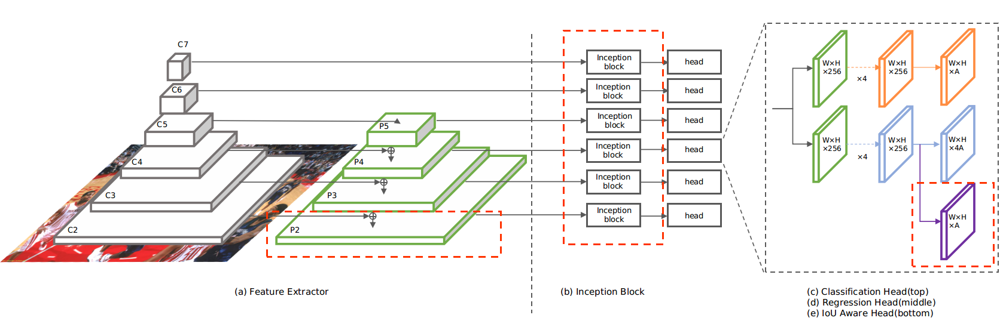

# TinaFace: Strong but Simple Baseline for Face Detection

## Introduction
```
@article{zhu2020tinaface,
  title={TinaFace: Strong but Simple Baseline for Face Detection},
  author={Zhu, Yanjia and Cai, Hongxiang and Zhang, Shuhan and Wang, Chenhao and Xiong, Yichao},
  journal={arXiv preprint arXiv:2011.13183},
  year={2020}
}
```

Providing a strong but simple baseline method for face detection named TinaFace. The architecture of TinaFace is shown below.



## Data Preparation

### WIDER FACE
a. Convert raw data to PASCAL-VOC format by this [tool](https://github.com/akofman/wider-face-pascal-voc-annotations).

b. Get *Annotations* folder generated by last step and change the folder structure as follows.
```plain
vedadet
├── vedadet
├── vedacore
├── tools
├── configs
├── data
│   ├── WIDERFace
│   │   ├── WIDER_train
│   │   │   ├── 0--Parade
│   │   │   ├── ......
│   │   │   ├── 61--Street_Battle
│   │   │   ├── Annotations
│   │   ├── WIDER_val
│   │   │   ├── 0--Parade
│   │   │   ├── ......
│   │   │   ├── 61--Street_Battle
│   │   │   ├── Annotations
```
where *0--Parade*, *61--Street_Battle* and etc. folders contain images.

c. Run the following code to generate txt file of xmls.
```shell
cd ${vedadet_root}
bash configs/trainval/tinaface/gen_xml_name_txt.sh
```

d. Download the [eval_tools](http://shuoyang1213.me/WIDERFACE/support/eval_script/eval_tools.zip) to get the ground truth files and run
the following code to filter the ignore face boxes.
```shell
cd ${vedadet_root}
python configs/trainval/tinaface/filter_widerface_val.py --gt_path downloaded_eval_tools_dir/ground_truth --ann_path data/WIDERFace/WIDER_val/Annotations/
```

## Train
Follow the official instructions on [vedadet](https://github.com/Media-Smart/vedadet).

## Evaluation
Widerface txt files will be generated at `${vedadet_root}/eval_dirs/tmp/tinaface/` after running the following code and then use [eval_tools](http://shuoyang1213.me/WIDERFACE/support/eval_script/eval_tools.zip) to evaluate the WIDERFACE performance.
```shell
python configs/trainval/tinaface/test_widerface.py configs/trainval/tinaface/tinaface_r50_fpn_gn_dcn.py weight_path
```

## Infer
Follow the official instructions on [vedadet](https://github.com/Media-Smart/vedadet).

## Results and Models

### WIDERFACE

| Model  |  Size  | AP50(VOC12) | Easy | Medium | Hard | Download |
|:---------:|:-------:|:-------:|:--------:|:--------------:|:------:|:--------:|
| R50-FPN-GN-DCN | (1100, 1650) |   0.923   | 0.963  |  0.957   |  0.930  | model weights on [Google Drive](https://drive.google.com/file/d/1zU738coEVDBkLBUa4hvJUucL7dcSBT7v/view?usp=sharing) and [Baidu Drive(z4gu)](https://pan.baidu.com/s/12flU7IX-2pNRKTZEeYiQ1Q)|
| R50-FPN-BN | (1100, 1650) |   0.916   | 0.957  |  0.954   |  0.922  | model weights on [Google Drive](https://drive.google.com/file/d/1zZ88-H3721F4V9-9NVpHFrbcpACflrHU/view?usp=sharing) and [Baidu Drive(q459)](https://pan.baidu.com/s/147wBXmuVmu7RufuvbXMGfQ)|


